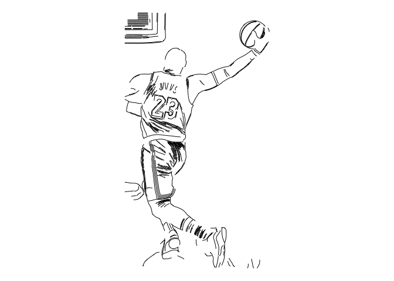
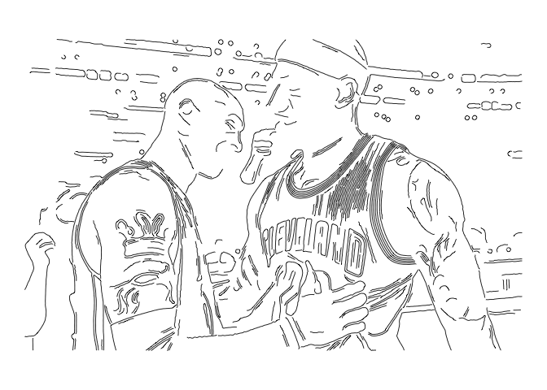
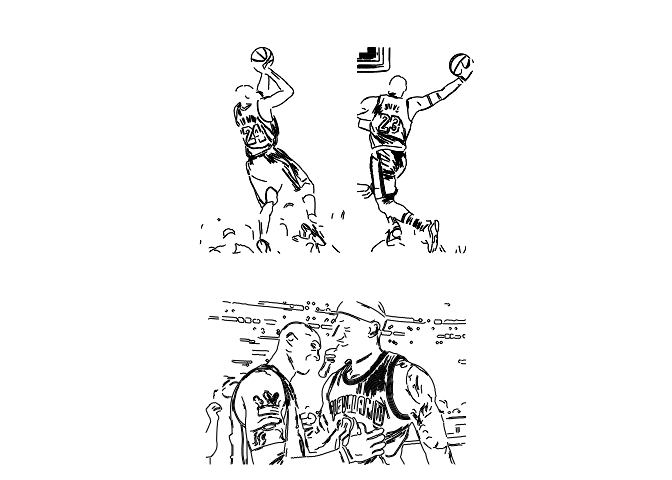

ggSketch
================
Jiawang Liu
2025-11-22

# Install

    # install.packages("devtools")
    devtools::install_github("Jiawang1209/ggSketch")

or

    # install.packages("pak")
    pak::pak("Jiawang1209/ggSketch")

# Load R Package

``` r
library(ggSketch)
library(ggplot2)
```

    ## Warning: package 'ggplot2' was built under R version 4.5.2

``` r
library(dplyr)
```

    ## 
    ## Attaching package: 'dplyr'

    ## The following objects are masked from 'package:stats':
    ## 
    ##     filter, lag

    ## The following objects are masked from 'package:base':
    ## 
    ##     intersect, setdiff, setequal, union

``` r
library(patchwork)
```

# Example Data

``` r
img1 <- system.file("extdata", "Kobe.png", package = "ggSketch")

p1 <- ggSketch(photopath = img1,
               color = "#000000",
               linewidth = 0.3)

p1
```

<!-- -->

``` r
img2 <- system.file("extdata", "LeBron.png", package = "ggSketch")

p2 <- ggSketch(photopath = img2,
               color = "#000000",
               linewidth = 0.3)

p2
```

<!-- -->

``` r
img3 <- system.file("extdata", "Kobe_LeBron.png", package = "ggSketch")

p3 <- ggSketch(photopath = img3,
               color = "#000000",
               linewidth = 0.3)

p3
```

<!-- -->

``` r
p_combine <- (p1 + p2) / p3

p_combine
```

<!-- -->

# sessionInfo

``` r
sessionInfo()
```

    ## R version 4.5.1 (2025-06-13)
    ## Platform: aarch64-apple-darwin20
    ## Running under: macOS Sequoia 15.6
    ## 
    ## Matrix products: default
    ## BLAS:   /Library/Frameworks/R.framework/Versions/4.5-arm64/Resources/lib/libRblas.0.dylib 
    ## LAPACK: /Library/Frameworks/R.framework/Versions/4.5-arm64/Resources/lib/libRlapack.dylib;  LAPACK version 3.12.1
    ## 
    ## locale:
    ## [1] en_US.UTF-8/en_US.UTF-8/en_US.UTF-8/C/en_US.UTF-8/en_US.UTF-8
    ## 
    ## time zone: Asia/Shanghai
    ## tzcode source: internal
    ## 
    ## attached base packages:
    ## [1] stats     graphics  grDevices utils     datasets  methods   base     
    ## 
    ## other attached packages:
    ## [1] patchwork_1.3.2 dplyr_1.1.4     ggplot2_4.0.1   ggSketch_0.1.0 
    ## 
    ## loaded via a namespace (and not attached):
    ##  [1] gtable_0.3.6                compiler_4.5.1             
    ##  [3] tidyselect_1.2.1            Rcpp_1.1.0                 
    ##  [5] magick_2.9.0                dichromat_2.0-0.1          
    ##  [7] scales_1.4.0                yaml_2.3.10                
    ##  [9] fastmap_1.2.0               lattice_0.22-7             
    ## [11] R6_2.6.1                    labeling_0.4.3             
    ## [13] generics_0.1.4              image.ContourDetector_0.1.1
    ## [15] knitr_1.50                  tibble_3.3.0               
    ## [17] pillar_1.11.1               RColorBrewer_1.1-3         
    ## [19] rlang_1.1.6                 sp_2.2-0                   
    ## [21] xfun_0.54                   S7_0.2.1                   
    ## [23] cli_3.6.5                   withr_3.0.2                
    ## [25] magrittr_2.0.4              digest_0.6.38              
    ## [27] grid_4.5.1                  rstudioapi_0.17.1          
    ## [29] lifecycle_1.0.4             vctrs_0.6.5                
    ## [31] evaluate_1.0.5              glue_1.8.0                 
    ## [33] farver_2.1.2                rmarkdown_2.30             
    ## [35] tools_4.5.1                 pkgconfig_2.0.3            
    ## [37] htmltools_0.5.8.1
